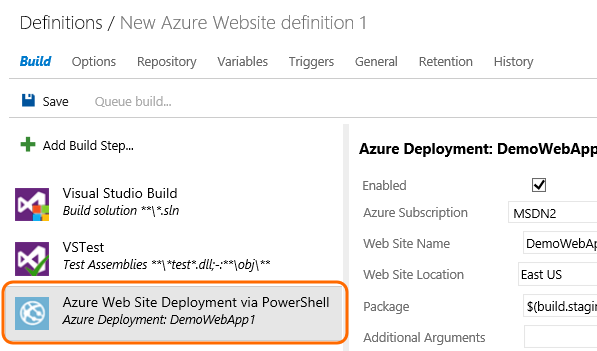

toc: show
Parent: ../index.md
Title: Build and deploy to Azure
ShortTitle: Deploy to Azure
ms.TocTitle: Deploy to Azure 
ms.ContentId: F3D6D8C5-E5A3-4CB4-BE7C-5972CE29D21F

#Build and deploy your web site to Azure

##Deploy using the Azure web site template

Deploy two Microsoft Azure web sites from a single solution in a Git repository.

<iframe width="420" height="315" src="https://www.youtube.com/embed/aLprCE3uRHs" frameborder="0" allowfullscreen="true" caps_internal_Id="8917921f-c672-4705-9e1c-425c54e82f53" />

##Deploy using the Powershell script that Visual Studio generates

If you need to customize how your web site is deployed, use the PowerShell script generated by Visual Studio.

<iframe width="420" height="315" src="https://www.youtube.com/embed/uRI94SJ_XoE" frameborder="0" allowfullscreen="true" caps_internal_Id="f943aa0e-d63a-4515-baca-f6cd7fef2a69" />

##Build and Deploy your ASP.NET 5 Application to an Azure Web App

[Build and Deploy your ASP.NET 5 Application to an Azure Web App](deploy-aspnet5.md)

