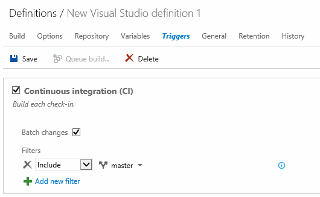
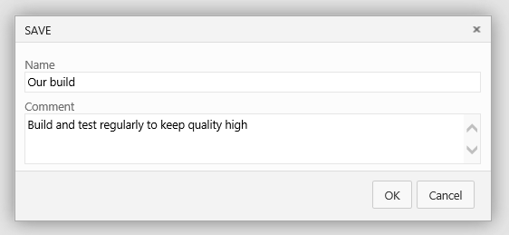
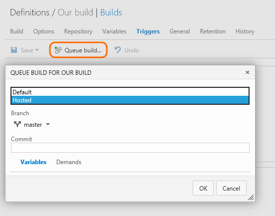

Toc: show
Parent: ./index.md
Title: Build your Java project with Maven
ShortTitle: Java with Maven
ms.TocTitle: Java with Maven
ms.ContentId: C339FAF9-A960-4A3A-9A8A-ADCD39C2703D

#Build your Java project with Maven

After you have deployed a [Windows build agent](/Library/vs/alm/Build/agents/windows.md) or an [Xplat build agent](/library/vs/alm/build/agents/xplat.md), you are ready to define a CI build that compiles and tests your Java project with Maven whenever your team checks in code.

##Create the definition

1.  Create the build definition.
    
    
    
    
2.  Add the Maven build step.
    
    
    
    
3.  Provide the path to your Maven POM file.
    
    
4.  Select the continuous integration (CI) trigger and specify the code you want to build.
    
    
5.  Save the definition.
    
    
    
    
6.  Queue your new definition to make sure it works.
    
    
    
    

Since this is a CI build, a build is started every time you push a commit to one of the branches specified on the Triggers tab.

##Q&A

[!INCLUDE [temp](/library/vs/alm/build/_shared/qa-variable-secret.md)]

